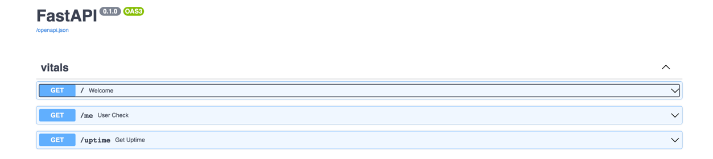
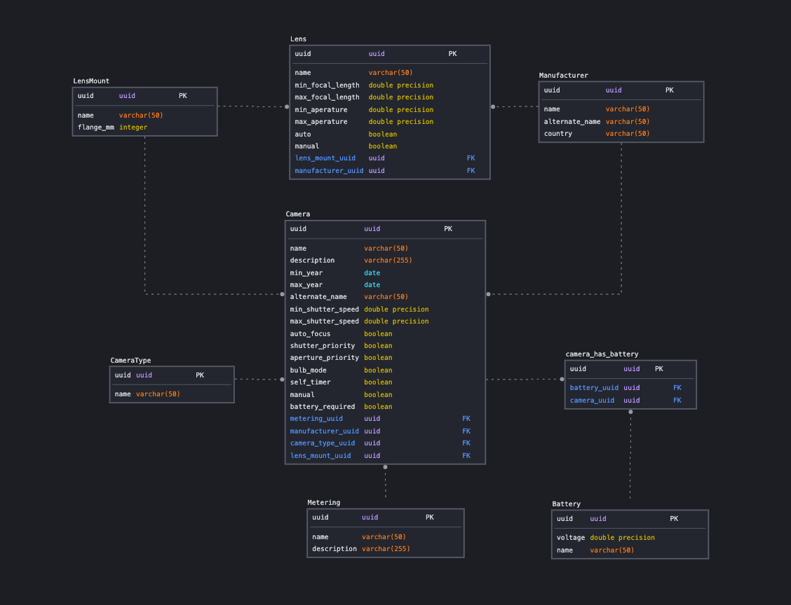

Not yet finished - repo goal is to have a local database of my camera collection and be able to make simple queries. 
example query - get all cameras that are compatible with a lens with a specific lens mount or find all lenses that fit this camera with a minimum aperature of 1.4


# Setup
##### Pre-requisites
* python 3.8.x 
* `docker-compose version 1.29.1`
* available ports on: `5432`, `6379`, and `8001`

##### Steps

1. Create a new virtual environment with python 3.8 and install requirements

```
python3.8 -m venv venv
source venv/bin/activate
pip install -r requirements.txt
```

2. Build and run containers (postgres, redis, FastAPI app) in detached mode 
`docker-compose --env-file .env.local -f fastcam-docker-compose.yml up -d --build`
   

3. Set up database. `ENVIRONMENT=development ./scripts/bash/reset_db.sh` This script Removes the container `fast-cam-postgres` and the volume `fastcamdb_fast-cam-postgres`, rebuilds the container, then applies schema migrations to the database and initializes the database. 
   
Note: this script can be ran at any point to start with a fresh database

4. Confirm setup by running pytest `docker-compose -f fastcam-docker-compose.yml exec fastcamdb python -m pytest -k setup`. You should see `1 passed, 4 deselected`

Note, you can set up the following alias `alias local_test='docker-compose -f fastcam-docker-compose.yml exec fastcamdb python -m pytest'` for easier testing `local_test -k setup`. When testing for all pytests you should see `5 passed in _.__s`

---------------------------------------

### Optional Steps
For running the app in a local environment outside a container (While still using the postgres and redis container.)

2. Confirm local environment with pytests `ENVIRONMENT=testing pytest app .` You should see ` 5 passed in _.__s`

3. To run the server manually: `ENVIRONMENT=development uvicorn app.main:app --reload --workers 4 --host 0.0.0.0 --port 8000`

---------------------------------------

## Interacting with the app
By navigating to `http://localhost:8001/docs` (for the server running in the container) or `http://localhost:8000/docs` (if you're running the server manually)
you will see the swagger doc interface 

---------------------------------------

## Initial SQL Diagram



